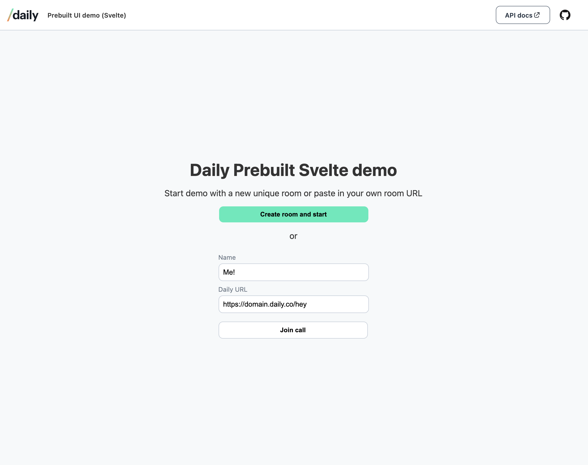
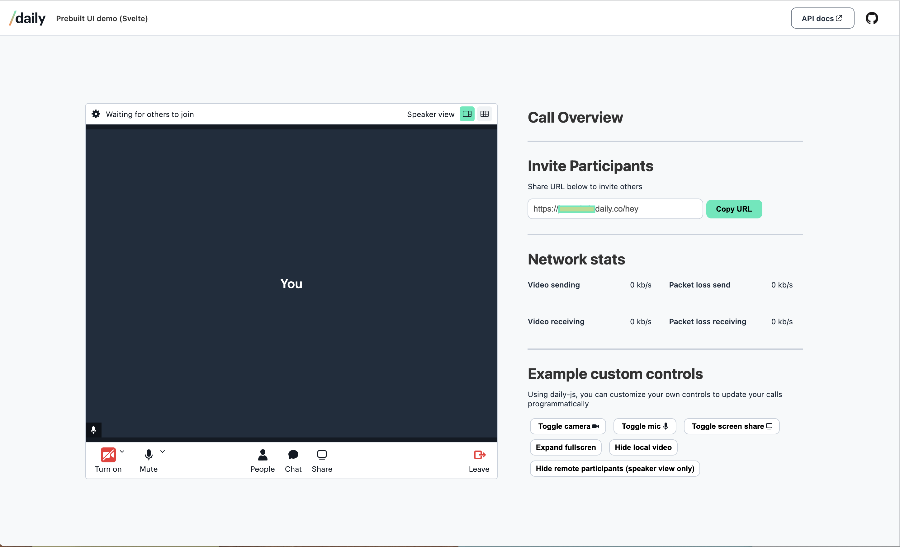

# Prebuilt UI demo (Svelte)

This is a demo of a [Svelte app](https://svelte.dev/) using Daily's embeddable [Daily Prebuilt widget](https://www.daily.co/prebuilt).




Test a deployed version of this app at [https://svelte-daily-prebuilt.netlify.app/](https://svelte-daily-prebuilt.netlify.app/).

---

## Requirements

To use this demo, you will first need to [create a Daily account](https://dashboard.daily.co/signup). You will need your Daily API key, which can be found on the [Developers](https://dashboard.daily.co/developers) page, if you want to create new rooms through the demo UI.

You can use existing Daily rooms in the demo by pasting the room URL into the input. The room URL should be in this format to be valid: `https://your-domain.daily.co/room-name`, with `daily-domain` changed to your domain, and `room-name` changed to the name of the existing room you would like to use.

---

## Running locally

To run this demo locally:

1. Install dependencies `npm install`
2. Start dev server `npm run dev`
3. Then open your browser and go to http://localhost:5000

_❗Note: Make sure you're viewing http://localhost:5000, not http://0.0.0.0:5000._

### Creating new rooms locally

To create rooms new rooms via the app UI while testing locally, follow the these additional steps:

- rename `env.example` to `.env`
- add your Daily API key (available in the Daily [dashboard](https://dashboard.daily.co/developers)) to `.env`

```
SVELTE_APP_DAILY_API_KEY=<-Your Daily API key here->
```

- In `api.js`, comment out the default request and uncomment the local request.
- Restart your server, i.e. re-run `npm run dev`

OR...

## Deploy on Netlify

If you want access to the Daily REST API (using the proxy as specified in `netlify.toml`), you can deploy your own copy of this repo with one click via Netlify:

[](https://app.netlify.com/start/deploy?repository=https://github.com/daily-demos/svelte-daily-prebuilt)

Note: You'll need your [Daily API key](https://dashboard.daily.co/developers) handy for this step.

Visit the deployed domain provided by Netlify after completing this step to view the app.
